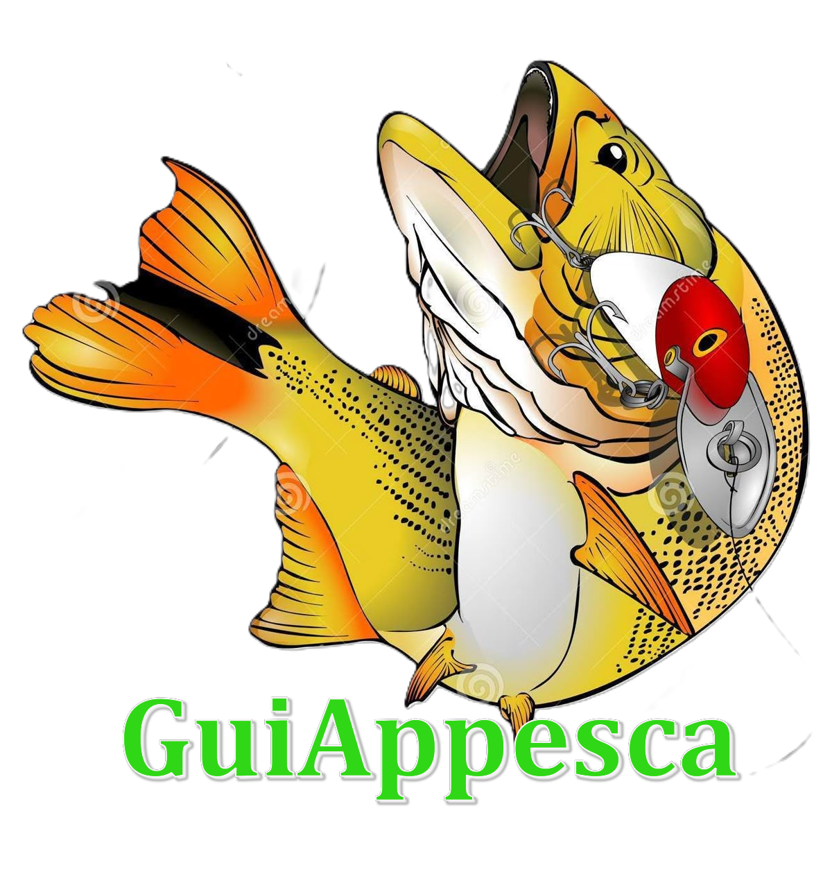

# GuiAppesca 🎣

Aplicación de gestión para guías de pesca profesionales.



## 📱 Características

- **Agenda del Guía**: Gestiona tus contrataciones de pesca
- **Calendario Inteligente**: Visualiza días ocupados y disponibles
- **Pronóstico del Clima**: Información meteorológica de 10 días
- **Servicios de Pesca**: Catálogo de servicios disponibles
- **Contrataciones**: Sistema completo de reservas con:
  - Datos del cliente
  - Selección de fecha
  - Modalidades de pesca (Spinning, Trolling, Bait Casting)
  - Equipos de pesca personalizables
  - Hospedaje opcional
  - Gestión de pagos y señas
- **Compartir**: Comparte contrataciones como comprobantes
- **Persistencia**: Los datos se guardan localmente en el dispositivo

## 🚀 Instalación

### Android (APK)

El APK está listo en: `build/app/outputs/flutter-apk/app-release.apk`

**Para instalar:**
1. Transfiere el archivo APK a tu dispositivo Android
2. Habilita "Instalar aplicaciones de fuentes desconocidas" en Configuración
3. Abre el archivo APK y sigue las instrucciones
4. ¡Listo! Verás el icono del dorado en tu pantalla de inicio

### iOS (IPA) - Usando Codemagic

Para generar el IPA para iOS, sigue estos pasos:

#### 1️⃣ Crear cuenta en Codemagic

1. Ve a [https://codemagic.io](https://codemagic.io)
2. Regístrate con tu cuenta de GitHub, GitLab o Bitbucket
3. El plan gratuito incluye 500 minutos de build al mes

#### 2️⃣ Subir tu proyecto a GitHub

```bash
# Inicializa el repositorio Git
git init

# Agrega todos los archivos
git add .

# Haz el primer commit
git commit -m "Initial commit - GuiAppesca v1.0"

# Crea un repositorio en GitHub y luego:
git remote add origin https://github.com/TU_USUARIO/guiappesca.git
git branch -M main
git push -u origin main
```

#### 3️⃣ Conectar Codemagic con tu repositorio

1. En Codemagic, haz clic en "Add application"
2. Selecciona tu repositorio de GitHub
3. Codemagic detectará automáticamente que es un proyecto Flutter

#### 4️⃣ Configurar el build de iOS

El archivo `codemagic.yaml` ya está configurado en el proyecto con tres workflows:

- **ios-workflow**: Solo para iOS
- **android-workflow**: Solo para Android
- **all-platforms-workflow**: Para ambas plataformas

#### 5️⃣ Configurar certificados de iOS (Importante)

Para iOS necesitas:

1. **Apple Developer Account** ($99/año)
   - Regístrate en [https://developer.apple.com](https://developer.apple.com)

2. **En Codemagic**:
   - Ve a "Teams" → "Code signing identities"
   - Sube tu certificado de desarrollo de iOS
   - Agrega tu provisioning profile

3. **Sin cuenta de Apple Developer**:
   - Puedes usar desarrollo personal (gratis)
   - Solo podrás instalar en TU dispositivo
   - Limitado a 7 días de validez

#### 6️⃣ Ejecutar el build

1. En Codemagic, selecciona el workflow deseado
2. Haz clic en "Start new build"
3. Espera 10-20 minutos
4. Descarga el IPA generado

## 📋 Requisitos del Sistema

### Para Desarrollo
- Flutter SDK 3.9.2 o superior
- Dart SDK incluido con Flutter
- Android Studio (para Android)
- Xcode (solo para iOS, requiere macOS)

### Para Usuarios Finales
- **Android**: Versión 5.0 (Lollipop) o superior
- **iOS**: Versión 11.0 o superior

## 🔧 Dependencias Principales

```yaml
dependencies:
  flutter_localizations
  intl: ^0.20.2
  shared_preferences: ^2.2.2
  geolocator: ^10.1.0
  geocoding: ^2.1.1
  http: ^1.1.0
  permission_handler: ^11.0.1
```

## 🎨 Estructura del Proyecto

```
guiappesca/
├── lib/
│   ├── main.dart              # Archivo principal de la app
│   └── widgets/
│       └── calendar_widget.dart  # Widget del calendario
├── assets/
│   └── images/
│       ├── dorado_guiappesca.png  # Imagen del dorado
│       └── dorado_logo.png        # Logo de la app
├── android/                   # Configuración Android
├── ios/                       # Configuración iOS
├── pubspec.yaml              # Dependencias
├── codemagic.yaml           # Configuración CI/CD
└── README.md                # Este archivo
```

## 🌟 Pantallas de la App

1. **Pantalla Principal**
   - Título "GuiAppesca" con logos del dorado
   - Widget de Agenda
   - Widget de Clima
   - Widget de Servicios de Guías

2. **Agenda del Guía**
   - Calendario con días ocupados marcados
   - Lista de contrataciones guardadas
   - Botón para nueva contratación

3. **Nueva Contratación**
   - Formulario completo de datos del cliente
   - Selección de servicios y equipos
   - Advertencia de conflictos de fechas
   - Cálculo automático de precios

4. **Pronóstico del Clima**
   - Clima actual con localización
   - Pronóstico extendido de 10 días

5. **Servicios de Guías**
   - Catálogo de servicios de pesca
   - Precios y descripciones
   - Información de contacto

## 🔑 API Keys Requeridas

### OpenWeatherMap (para el clima)
1. Regístrate en [https://openweathermap.org](https://openweathermap.org)
2. Obtén tu API key gratuita
3. Actualiza el código en `lib/main.dart` (línea con `apiKey`)

## 📝 Notas Importantes para Codemagic

### Configuración de Email
En el archivo `codemagic.yaml`, cambia el email:
```yaml
recipients:
  - tu_email@ejemplo.com  # Cambia esto por tu email real
```

### Variables de Entorno (Opcional)
Si quieres usar variables de entorno para API keys:
1. En Codemagic, ve a "Environment variables"
2. Agrega: `OPENWEATHER_API_KEY`
3. Usa en el código: `const apiKey = String.fromEnvironment('OPENWEATHER_API_KEY')`

### Build Triggers
Puedes configurar builds automáticos:
- En cada push a `main`
- En cada pull request
- Manualmente desde Codemagic

## 🐛 Solución de Problemas

### "Icons.fishing not found"
Este error ya está resuelto en la versión actual. Se usa `Icons.set_meal` en su lugar.

### "LocaleDataException"
Asegúrate de que `flutter_localizations` esté en las dependencias.

### Permisos de ubicación
En Android, los permisos ya están configurados en `AndroidManifest.xml`

## 📞 Soporte

Para preguntas o problemas, contacta al desarrollador.

## 📄 Licencia

Proyecto privado - Todos los derechos reservados.

---

**Desarrollado con Flutter 💙**
